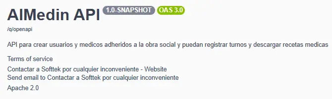
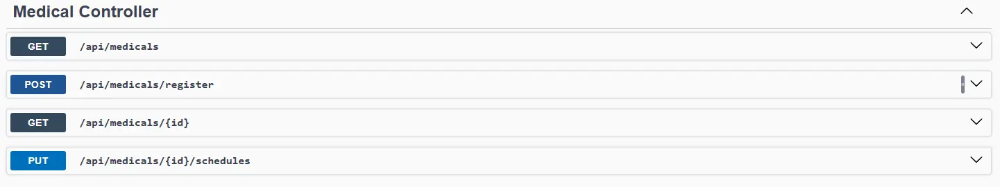
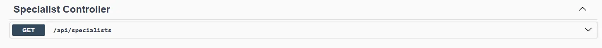
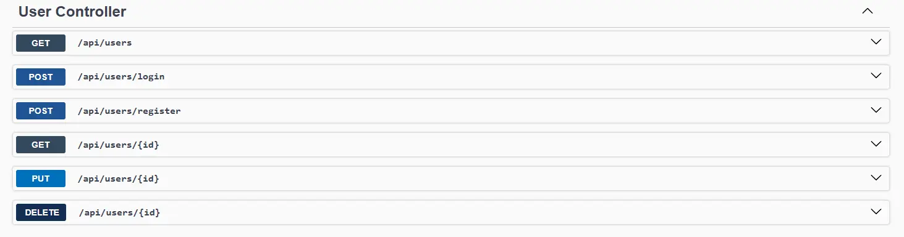
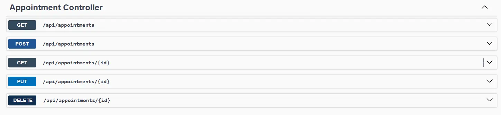

# AlMedin API

Una API que agilioza la visualizacion y registro de turnos con medicos aderidos a la obra social.

---

## Running the application

Configure una base de datos `mysql` o `h2` en el `.env.template` como se ve a continuacion.

``` 
db.url= # tu rul de base de datos #
db.username= # tu usuario #
db.password= # tu contraseña #
db.kind= # mysql | h2 #
db.port= # puerto de la aplicacion (opcional) #

# copiar el archivo, setear las variables y cambiar por el nombre de -> .env.properties

```


You can run your application in dev mode that enables live coding using:
```shell script
./mvnw compile quarkus:dev
```


# Strucure and Dependencies

Utilizamos una estructura de carpetas donde nos permite separar las responsabilidades de cada clase agrupandolas de la siguiente manera.

### Java Structure

Un pantallazo rapido de la estructura de carpetas elejida para llevar a delante esta API.

```bash
├───main
│   ├───docker
│   ├───java
│   │   ├───config
│   │   │   └───annotations
│   │   ├───controllers
│   │   ├───dto
│   │   │   ├───request
│   │   │   └───response
│   │   ├───exceptions
│   │   │   └───handler
│   │   ├───mapper
│   │   ├───models
│   │   │   └───enumerations
│   │   ├───repositories
│   │   ├───services
│   │   │   └───impl
│   │   └───validator
│   └───resources
└───test
    └───java
        └───org
            └───acme
```

- **config**:
  -  **annotations**: Anotaciones perzonalizadas para customizar la api de Swagger.
- **controllers**: Los cuales especifican las rutas de recursos que estan disponible.
- **dto**
    - **request**: Objetos de transferencia de datos (DTO) para datos de entrada a la aplicacion. 
    - **response**: Objetos de transferencia de datos para datos de salida como respuesta.
- **exceptions**: Donde se encuentran todas las clases de ecepciones personalizadas.
- **handler**: Handler para capturar y tratar esas ecepciones.
- **mapper**: Clases de mapeos para objetos. 
- **models**: Capa de persistencia donde estan definidas las entidades y relaciones. 
    - **enumeratios**: Enums utiles para estas entidades.
- **repository**: Capa DAO donde se hacen las querys y consultas a base de datos.
- **services**: Especificacion de la logica de negocio.
    - **impl**: Implementacion de estas especificaciones de negocio. 
- **validator**: Clases para validar datos de entrada utilizando como apoyo lo DTO.
- **resources**: Contenido de archivos de propiedades y configuraciones de la aplicacion.


## Dependencies utilizadas
 - `Lombok`
 - `quarkus-resteasy`
 - `quarkus-resteasy-jsonb`
 - `quarkus-ark`
 - `quarkus-hibernate-orm`
 - `quarkus-hibernate-orm-panache`
 - `quarkus-hibernate-validator`
 - `quarkus-security-jpa`
 - `quarkus-smallrye-openai`
 - `quarkus-jdbc-mysql`
 - `quarkus-jdbc-h2`
 - `rest-assured`


# Api Description

Puede ver la documentacion completa de los recursos levantando la aplicacion e ingresando a la ruta.
```
http://localhost:8080/q/swagger-ui
```


### Medical Controller


    Register a new medical
    /api/medicals/register -> POST
    
    Get all medicals
    /api/medicals -> GET

    Get one medical
    /api/medicals/{id} -> GET

    Update a medical
    /api/medicals/{id}/schedules -> PUT


### Specialist Controller



    Get all specialists
    /api/specialists -> GET

### User Controller



    Get all users
    /api/users -> GET

    Login user
    /api/users/login -> POST

    Register a new user
    /api/users/register -> POST

    Get one user
    /api/users/{id} -> GET

    Update one user
    /api/users/{id} -> PUT

    Delete one user
    /api/users/{id} -> DELETE

### Prescription Controller


    Post a prescription 
    /api/prescriptions/{appointmentId}

    Get a prescription 
    /api/prescriptions/{prescriptionId}


### Appointment Controller


    Get all appointments
    /api/appointments -> GET
    
    Post a new appointments
    /api/appointments -> POST

     Get one appointments
    /api/appointments/{id} -> GET

    Update one appointment
    /api/appointment/{id} -> PUT

    Delete a appointment
    /api/appointments/{id} -> DELETE
    
### Puntos a mejorar

 - Test en la aplicacion
 - Validar algunos datos de entrada 
 - implementacion de seguridad tanto autenticacion como autorizacion.
 - Posibles optimizaciones en las querys a base de datos
